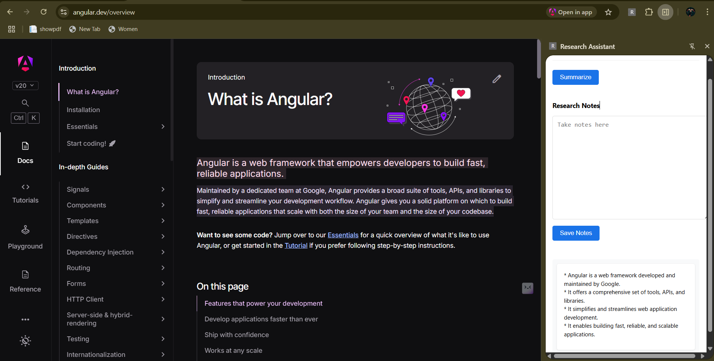
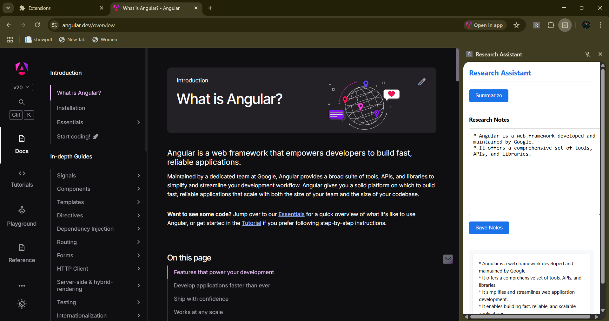

# 🧠 Research Assistant – Chrome Extension

The **Research Assistant** Chrome Extension is your intelligent research companion! It enables you to **summarize selected content**, **save notes**, and manage research insights — all within your browser.

---

## ▶️ Demo Video

[](https://youtu.be/1RhI0hKKSnM)

📽️ [Click here to watch on YouTube](https://youtu.be/1RhI0hKKSnM)

---

## 🔍 Features

- ✂️ **Summarize Selected Content**: Highlight text and instantly generate AI-powered summaries.
- 💾 **Save Notes**: Store your summaries and research points for future reference.
- 🗃️ **Manage Notes**: View, filter, and organize all saved content in one place.
- ⚡ **Minimal UI**: Clean and lightweight popup for quick interaction.
- 🌐 **Works Across All Sites**: Compatible with blogs, research articles, docs, and more.

---

## 📸 Extension-ui

### 📌 Extension Icon  


### ✂️ Select Content & Generate Summary  


### 🗃️ View & Manage Saved Notes  


---

## 🛠️ Tech Stack

| **Frontend** | **Backend** | **AI Model** | **Deployment** | **Storage** |
|--------------|-------------|--------------|----------------|-------------|
|    |  |  |   |  |

- 🌐 **Frontend**: HTML, CSS, JavaScript (Chrome Extension APIs)  
- ☕🚀 **Backend**: Spring Boot, Spring AI, REST APIs  
- 🧠🔮 **AI Model**: Google Gemini Pro (via Spring AI)  
- 🐳🚀 **Deployment**: Docker, Render  
- 💾🗂️ **Storage**: Chrome Local Storage / IndexedDB

---

## 🌐 Live Backend

🔗 [https://research-assistant-backend.onrender.com](https://research-assistant-backend.onrender.com)

---

## 🧩 Chrome Extension Setup (Development)

1. **Clone the repo**
2. Open Chrome and go to `chrome://extensions/`
3. Enable **Developer Mode**
4. Click **Load Unpacked** and select the `chrome-extension/` directory
5. Pin the extension to your toolbar and start using it!

---

## 🧪 Coming Soon

- 🌙 Dark Mode support  
- 🗃️ Export Notes as PDF / Markdown  
- 📊 Analytics Dashboard for research tracking  
- 🧠 Multi-language Summarization  

---

## 💡 Sample Use Cases

- 🔍 Summarize articles, blogs, papers
- 📖 Quickly extract key points from long reads
- 📝 Turn content into structured notes
- 💼 Useful for students, researchers, content writers

---

## 🧰 Backend Setup (Locally)

### 🔹 Clone & Run with Maven

```bash
git clone https://github.com/yourusername/research-assistant.git
cd research-assistant

./mvnw clean install
./mvnw spring-boot:run

```
### ✅ Add your Gemini API key

In your `application.properties`, set the following:

```properties
gemini.api.url=https://generativelanguage.googleapis.com/v1beta/models/gemini-1.5-flash:generateContent?key=
gemini.api.key=${GEMINI_KEY}

```
💡 Make sure to define the GEMINI_KEY environment variable before running the application:

🐧 Linux/macOS
```
export GEMINI_KEY=your_actual_gemini_api_key
```
🪟 Windows (CMD)
```
set GEMINI_KEY=your_actual_gemini_api_key
```
💻 Windows (PowerShell)
```
$env:GEMINI_KEY="your_actual_gemini_api_key"
```
🐳 Run with Docker
```
docker build -t research-assistant .
docker run -p 8080:8080 research-assistant
```
---
### 📂 Project Structure
```
research-assistant/
├── chrome-extension/
│   ├── popup/
│   ├── content/
│   ├── background/
│   ├── css/
│   ├── icons/
│   └── manifest.json
├── src/
│   └── main/java/com/research/assistant/
│       ├── ResearchController.java
│       ├── ResearchService.java
│       └── GeminiResponse.java
│   └── resources/application.properties
├── Dockerfile
├── pom.xml
└── README.md
```
---


---
## <span style="color:#E74C3C">📧 Contact Information</span>

For inquiries or feedback, feel free to contact:

- **Email**: [hg979084@gmail.com](mailto:hg979084@gmail.com)
- **LinkedIn**: [Hardik Gupta](https://www.linkedin.com/in/hardik-gupta830)

---

<span style="color:#2ECC71">🙏 Thank you for visiting! We look forward to your feedback and contributions.</span>
